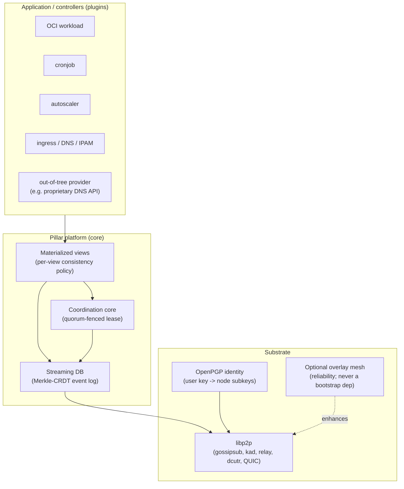
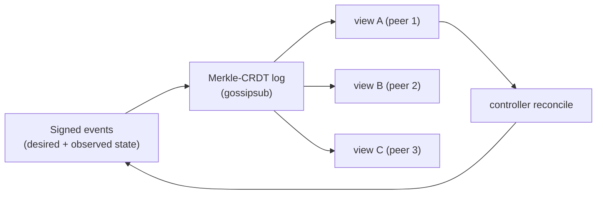

# Architecture

> Status: foundational draft. Components below are being built bottom-up; each
> gains its TLA+ specification and Rust refinement before it is depended upon.

## Layers

## The state model

Cluster state is a **materialized view of a streaming database**. An
append-only, content-addressed event log (a Merkle-CRDT, propagated via libp2p
gossipsub) is the source of truth. Every stateless peer subscribes and locally
reduces the log into current state; controllers are reducers that read a view
and emit new events.

Because replay-from-genesis does not scale, the log is periodically compacted
into **content-addressed snapshots** shared over the same layer. A new peer
bootstraps from the latest snapshot plus the tail of the log.

### Consistency is a property of the stream, exposed through views

A view can never be more consistent than the stream that feeds it. Consistency
policy therefore attaches to the log partition (the write/ordering path) and is
inherited by views. The two policies — strict (CP) and relaxed (AP) — and the
rules for choosing between them are specified in
[consistency-model.md](consistency-model.md).

## Identity and authorization

Identity is rooted in **OpenPGP**. A human/user primary key authorizes one or
more **node subkeys**; a node joins the cluster through a registration
handshake signed up the key hierarchy. Controllers act under capability-scoped
subkeys — an out-of-tree provider holding a proprietary credential is granted
only the capabilities it needs and never inherits ambient cluster authority.

## Distributed-authority primitives collapse onto one core

IPAM (IPv4/IPv6 allocation from a delegated pool), standards-based DDNS
ownership, cron-fire, ingress-endpoint ownership, and controller leadership are
**all consumers of the same coordination core**: each is "grant exactly one
actor the exclusive right to do X." Building and verifying that primitive once
(see the coordination core) is what makes the surface tractable.

## Transport reachability (why third-party routing is not a core problem)

Multi-hop event delivery is inherent to gossipsub (messages propagate through
third-party peers). Unicast to a node behind NAT is handled by libp2p
`relay` + `dcutr` hole-punching + QUIC/WebRTC. What remains as an *optional*
concern is metadata privacy (who talks to whom / who runs what), addressed by
opt-in overlays such as Tor hidden services — never a core requirement.
