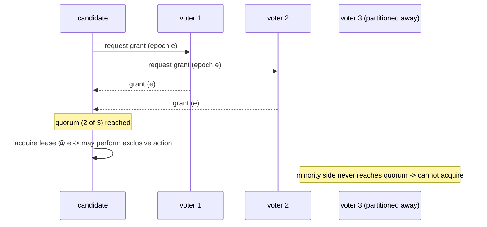

# Consistency model

Pillar cannot pick a single point on the CAP triangle for everyone. Network
partitions are a fact (`P` is not optional), so during a partition each resource
must choose between consistency and availability. Pillar makes that choice
**per view**, and *proves* the strict side correct in TLA+.

## Two resource classes

Every resource declares the nature of its side effect:

| Side effect | Meaning | Example | Allowed view policy |
|-------------|---------|---------|---------------------|
| **Exclusive** | non-idempotent / must run exactly once | fire a cronjob that emails customers; claim a public DNS name; allocate a unique address; run a stateful singleton | **Strict only** |
| **Convergent** | idempotent / cheaply reclaimable | stateless replica; ECMP-absorbed route advertisement; allocation later GC'd | Strict or **Relaxed** |

The dividing line is **reversibility of the side effect**, not whether the app
is "distributed." This classification is encoded in
`pillar_core::SideEffect`, and the admission rule
(`ViewPolicy::admits`) refuses an exclusive action under a relaxed view.

## The two view policies

- **Strict (CP).** Exclusive actions are gated on the coordination core below.
  A minority partition cannot acquire authority and therefore refuses to act —
  it starves rather than splitting the brain. Availability is sacrificed in the
  minority; safety is absolute.
- **Relaxed (AP).** State is a CRDT; writes always succeed and merge on heal.
  No exclusivity guarantee. Only ever valid for convergent side effects.

**Defer policy, never mechanism:** the platform always *provides* the strict
primitive; a view opts into it. A controller author who needs exactly-once does
not implement consensus — they declare `Strict` and rely on the proven core.

## The coordination core

The CP class is backed by a **quorum-fenced lease**, specified in
[`specs/CoordinationCore.tla`](../specs/CoordinationCore.tla) and refined by the
[`pillar-coordination`](../crates/pillar-coordination) crate.

### Proven properties

TLC exhaustively checks (8,920 distinct states in the 3-node/4-epoch instance):

- **`AtMostOneHolderPerEpoch`** — no two candidates ever hold the same epoch.
  Any two majorities intersect at some voter, and a voter grants at most one
  candidate per epoch, so a second holder is impossible. This is the split-brain
  exclusion that makes "I hold epoch e" a safe basis for an exclusive action.
- **`GrantsAreFenced`** — grants are monotonic; a higher epoch fences lower
  ones, so stale holders cannot re-assert authority.
- **`TypeOK`** — structural well-formedness.

The Rust test `at_most_one_holder_per_epoch_exhaustive` re-checks the same
property over every grant assignment for the small instance, keeping code and
model in lock-step.

### Not yet asserted (tracked follow-ups)

`CoordinationCore` is currently safety-only. Deadlock-freedom and liveness
(`Declared ~> Held` under a live majority), and the explicit `Partition`/`Heal`
actions with post-heal reconvergence of the AP class, are future spec work and
are **not** claimed here.

## Reducing how often the strict path is tested

The strict path stalls only during real partitions. Optional reliability
resources — an overlay mesh whose metadata rides the streaming DB, plus
UPnP/port-forwarding for NAT — reduce partition frequency and duration. They
improve *liveness*, never *safety*, and must never become a bootstrap
dependency of the substrate they run on.
