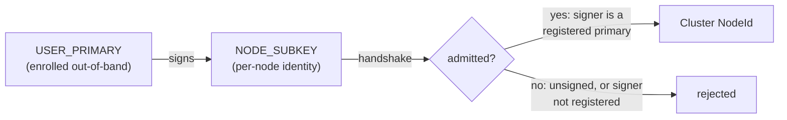

# Identity and admission

Pillar has no central directory of nodes. A node's right to participate is
instead **rooted in OpenPGP**: a human/user **primary** key authorizes one or
more **node subkeys**, and a node joins the cluster by presenting a subkey
whose signature chains to a primary that is currently registered.

## Key hierarchy

- **`USER_PRIMARY`** — a human's OpenPGP primary key. It becomes an
  *authorized* primary only after **registration** (out-of-band enrollment
  with Pillar); an unregistered primary can still exist and even mint
  signatures, but confers no authority until registered.
- **`NODE_SUBKEY`** — a per-node key, signed by some primary. Signing alone
  is not authority: a rogue or not-yet-registered primary can mint a
  signature over a subkey, and that signature must never by itself grant
  admission.
- **Handshake** — a node presents its subkey to join. This is the *only*
  action that can ever admit a subkey, and its guard *is* the admission
  policy: the subkey must (1) carry a genuine signature and (2) that
  signature's signer must be *currently* registered. Once admitted, the
  subkey projects to the node's `NodeId` in the coordination protocol (see
  [consistency-model.md](consistency-model.md)).

## Proven properties

The hierarchy and handshake are specified in
[`specs/Registration.tla`](../specs/Registration.tla) and model-checked by
TLC before being trusted:

- **`AdmissionRequiresAuthorizedChain`** — every admitted subkey is signed by
  a primary that is registered *at the time of admission*. No forged or
  unauthorized-primary admission is reachable under any interleaving of
  registration, subkey issuance (including by rogue primaries), and
  handshakes.
- **`NoAmbientAuthority`** — an unsigned subkey (`signedBy = None`) is never
  admitted. Bare possession of a subkey identity confers no authority; a
  signature is mandatory.
- **`TypeOK`** — structural well-formedness of the model's state.

Deliberately *not* modelled: revocation/expiry of a registration and its
effect on already-admitted subkeys, and multi-primary delegation chains
deeper than one hop. These are tracked as future spec work, not claimed here.

## Rust refinement

[`crates/pillar-identity`](../crates/pillar-identity) refines the model
directly:

- [`UserPrimary`] / [`NodeSubkey`] mirror the spec's `Users` / `Subkeys`.
- `Registry` tracks `registered` and `signedBy` exactly as the spec's state
  variables, and `Registry::handshake` is the sole path into `admitted` —
  same shape as the spec's guarded `Handshake` action.
- The crate's test `forged_or_unchained_subkey_is_rejected` /
  `chained_subkey_is_admitted` (see the crate's test suite) re-assert the two
  TLC-proven theorems above over the Rust implementation, keeping code and
  model in lock-step.

## Controller subkeys (capability scoping)

A node's admitted subkey is the *node's* identity, not a blanket grant to
every controller running on it. Controllers act under **capability-scoped**
subkeys carved out under the node subkey: a controller is authorized only for
the specific resource types/actions it needs, and an out-of-tree controller
holding a proprietary credential (e.g. a third-party DNS API key) never
inherits ambient cluster authority through the node's identity. This
capability-scoping is tracked by the `identity-controller-subkeys` task and
extends — rather than replaces — the admission model above.
